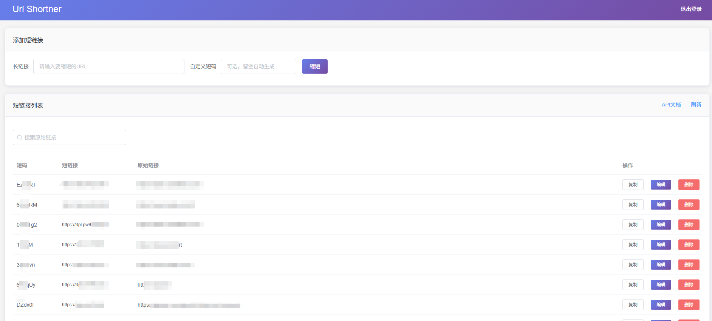
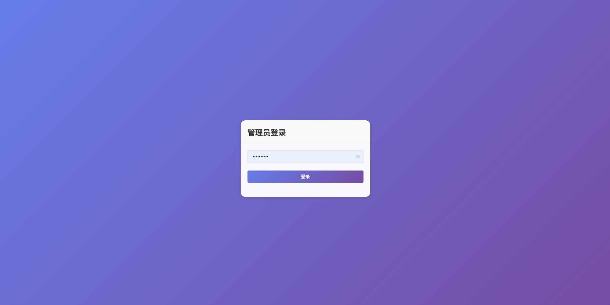
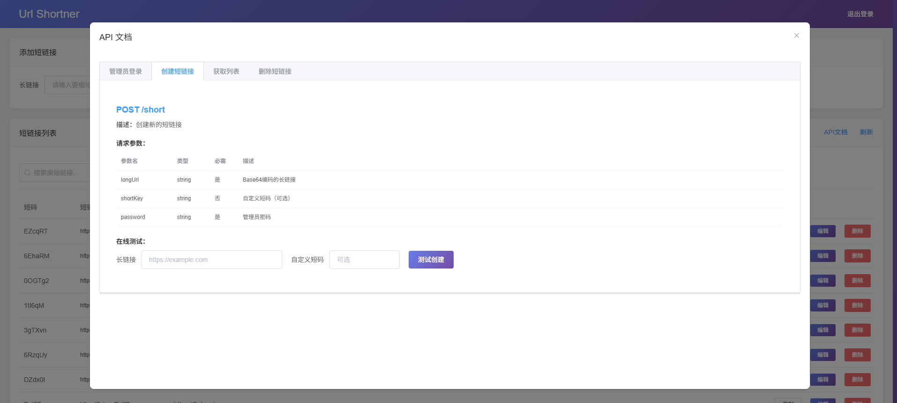

# Url Shortner - 短链接管理系统

基于 Cloudflare Pages 的短链接服务，带有管理员登录和数据管理功能。

## 界面预览

### 主界面



### 创建结果展示



### API 文档界面



## 功能特性

### 🔐 管理员登录

- 进入主页显示登录界面
- 管理密码：通过环境变量 `ADMIN_PASSWORD` 配置
- 支持会话保持（24 小时）

### 📊 数据管理

- 创建短链接（支持自定义短码）
- 数据列表展示（分页显示）
- 编辑现有链接
- 删除不需要的链接
- 一键复制短链接

### 📚 API 文档

- 内置在线 API 文档
- 支持在线测试所有 API
- 详细的参数说明和示例
- 实时响应结果展示

### 🛡️ API 安全

- 所有 API 调用需要密码验证
- 管理员密码存储在环境变量中
- 前端通过 `/api/login` 验证密码

## 技术栈

### 前端

- **Vue.js 2.6.11** - 渐进式 JavaScript 框架
- **Element UI 2.13.0** - 基于 Vue 的组件库
- **jQuery 3.6.0** - HTTP 客户端
- **Vue-clipboard2 0.3.1** - 剪贴板功能

### 后端

- **Cloudflare Pages** - 静态网站托管服务
- **Cloudflare KV** - 键值存储数据库

## 部署方法

### Cloudflare Pages

1. Fork 本仓库
2. 在 Cloudflare Pages 中创建新项目

- 连接到您的 GitHub 仓库
- 构建设置：
  - 构建命令：不需要
  - 输出目录：/

3. 创建 KV 命名空间


- 在 Cloudflare 控制台创建 KV 命名空间，命名为 "`LINKS`"
- 在 Pages 项目设置中绑定 KV：
  - 变量名：`LINKS`
  - KV 命名空间：选择刚创建的命名空间
    

4. 部署后 请重新部署后 即可使用 Pages 必须重重试部署 否则无法使用 KV 空间
   

## 项目结构

```
├── functions/
│   ├── short.js          # 处理短链接创建 (POST /short)
│   ├── [shortKey].js     # 处理短链接重定向 (GET /{shortKey})
│   └── api/
│       ├── login.js      # 管理员登录验证 (POST /api/login)
│       ├── list.js       # 获取短链接列表 (GET /api/list)
│       ├── delete.js     # 删除短链接 (POST /api/delete)
│       └── update.js     # 更新短链接 (POST /api/update)
├── index.html            # 管理界面前端页面
├── README.md
└── LICENSE
```

## 核心功能

- ✅ **管理员登录系统** - 密码保护的管理界面
- ✅ **数据列表管理** - 分页展示所有短链接
- ✅ **CRUD 操作** - 创建、查看、编辑、删除短链接
- ✅ **自定义短码** - 支持自定义短链接后缀
- ✅ **自动生成** - 自动生成随机短链接
- ✅ **密码验证** - 所有 API 调用需要密码验证
- ✅ **会话管理** - 24 小时登录状态保持
- ✅ **响应式设计** - 适配移动端和桌面端
- ✅ **一键复制** - 快速复制短链接到剪贴板

## API 说明

### 管理员登录

- **端点**: `POST /api/login`
- **参数**:
  - `password`: 管理员密码
- **响应**: 返回登录 token 和过期时间

### 创建短链接

- **端点**: `POST /short`
- **参数**:
  - `longUrl`: Base64 编码的长链接
  - `shortKey`: 可选的自定义短码
  - `password`: 管理员密码

### 获取链接列表

- **端点**: `GET /api/list`
- **参数**:
  - `page`: 页码
  - `pageSize`: 每页数量
  - `password`: 管理员密码

### 删除链接

- **端点**: `POST /api/delete`
- **参数**:
  - `shortKey`: 要删除的短码
  - `password`: 管理员密码

### 更新链接

- **端点**: `POST /api/update`
- **参数**:
  - `shortKey`: 要更新的短码
  - `longUrl`: 新的长链接
  - `password`: 管理员密码

### 访问短链接

- **端点**: `GET /{shortKey}`
- **响应**: 301 重定向到原始 URL

## 使用方法

1. 访问网站，输入在环境变量中设置的管理密码登录
2. 在管理界面中输入长链接，点击"缩短"按钮创建短链接
3. 创建成功后会弹出结果模态框，显示详细信息并可复制
4. 在数据列表中可以查看、编辑、删除已创建的短链接
5. 支持搜索功能，可以模糊查询原始链接
6. 点击"API 文档"按钮查看和测试所有 API 接口

## 环境变量配置

| 变量名           | 类型        | 必需 | 说明                                   |
| ---------------- | ----------- | ---- | -------------------------------------- |
| `ADMIN_PASSWORD` | string      | 是   | 管理员登录密码，请设置复杂密码确保安全 |
| `LINKS`          | KV 命名空间 | 是   | 用于存储短链接数据的 KV 命名空间       |

## 部署注意事项

1. **KV 绑定是必需的**：确保在 Pages 设置中正确绑定 KV 命名空间
   - 变量名称：`LINKS`
2. **环境变量设置**：在 Pages 控制台添加环境变量
   - 变量名：`ADMIN_PASSWORD`
   - 变量值：设置你想要的管理员密码（建议使用复杂密码）
3. **重新部署**：绑定 KV 和设置环境变量后必须重新部署项目
4. **域名配置**：可以绑定自定义域名以获得更短的链接
5. **HTTPS**：Cloudflare Pages 默认提供 HTTPS 支持

## 安全建议

- 🔐 **强密码**：请为 `ADMIN_PASSWORD` 设置复杂密码
- 🔒 **HTTPS 访问**：始终通过 HTTPS 访问管理界面
- ⏰ **会话过期**：登录会话 24 小时后自动过期
- 🚫 **私有部署**：建议不要公开部署地址

## 安全改进

- ✅ **密码保护**：管理员密码存储在环境变量中，不会暴露在前端代码中
- ✅ **API 验证**：所有管理 API 都需要密码验证
- ✅ **会话管理**：登录状态本地保存，24 小时过期
- ✅ **结果展示**：创建成功后弹出详细结果模态框
- ✅ **搜索功能**：支持原始链接的模糊查询
- ✅ **数据排序**：新创建的链接自动显示在列表前面
